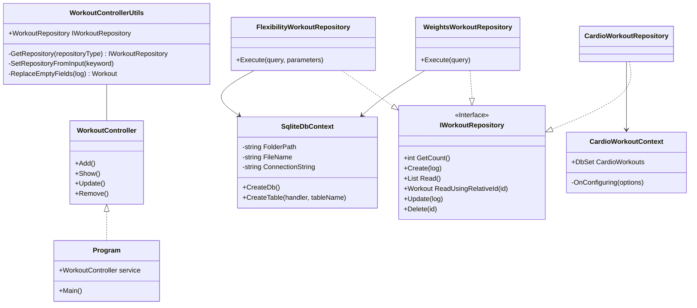
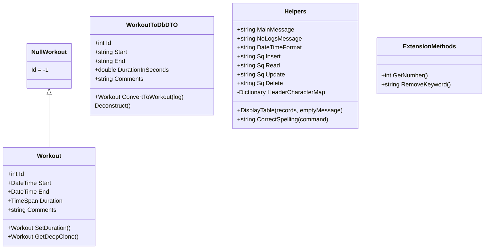

# Exercise Tracker   &nbsp;  
A simple exercise logger for you to measure your progress!
## Getting Started:
Note: Use help to display this message
* **exit or 0**: stop the program
* **show**: display existing logs
* **add**: create an exercise log
* **update [id]**: change an existing log
* **remove [id]**: delete a log
## Main Program Flow UML

## Utility & Model UML

## Motivation & Features
This project is a simple command line based tool that helps you to keep track of your workouts. The purpose of this project is to gain an understanding of the repository pattern in C#. To further cement my comprehension using this pattern, I explored using two kinds of workouts - cardio and weight workouts. Cardio workouts are fetched using the Entity Framework and SQLite for weight workouts.

## Further reading & References
* EF Core docs: https://docs.microsoft.com/en-us/ef/core/get-started/overview/first-app?tabs=netcore-cli
* Implementing the repository pattern: https://www.programmingwithwolfgang.com/repository-pattern-net-core/
## Contribution
If you have any ideas,   [open an issue](https://github.com/CodeDreamer06/ExerciseTracker/issues/new)  and tell me what you think. If you'd like to contribute, please fork the repository and make changes as you'd like. Pull requests are warmly welcome.
1. Fork it
2. Create your feature branch (`git checkout -b feature/fooBar`)
3. Commit your changes (`git commit -am 'Add some fooBar'`)
4. Push to the branch (`git push origin feature/fooBar`)
5. Create a new pull request